## simple FNN on 2D point set
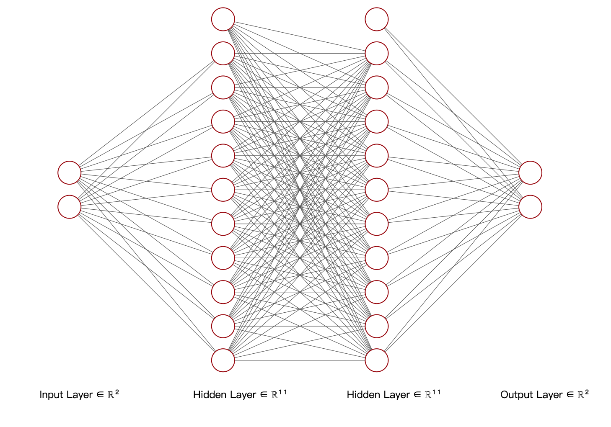

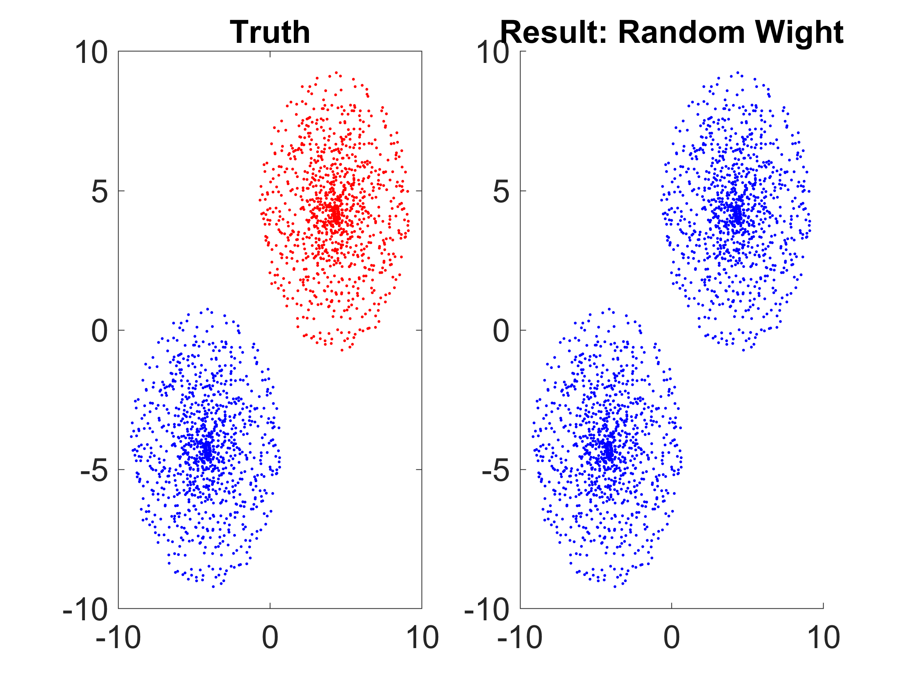
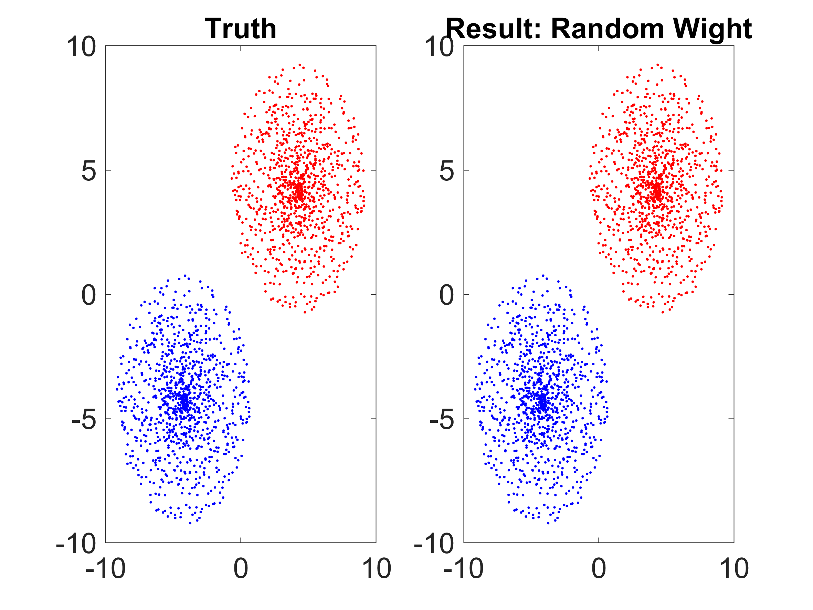
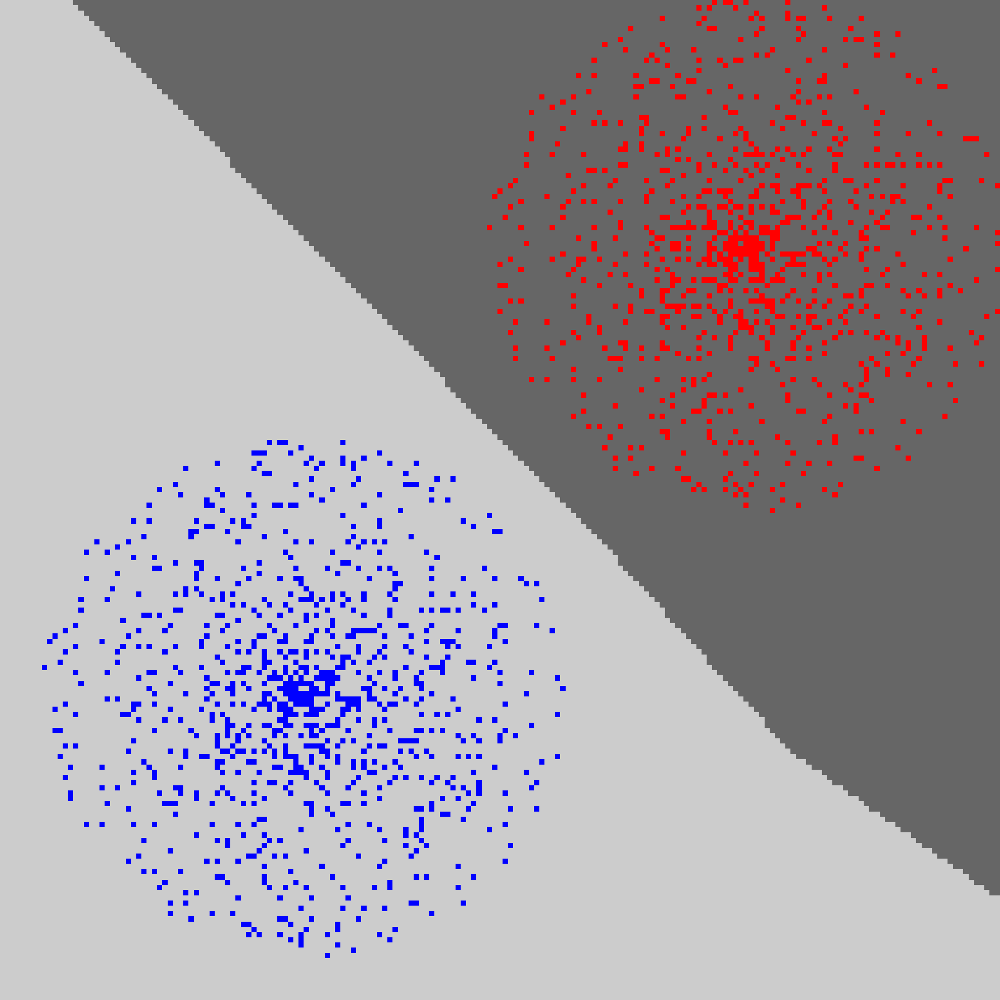

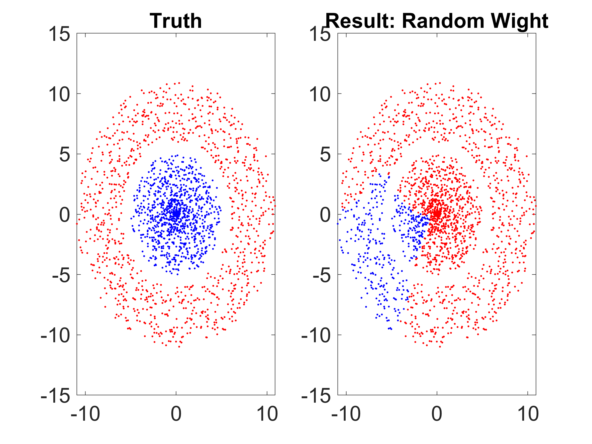
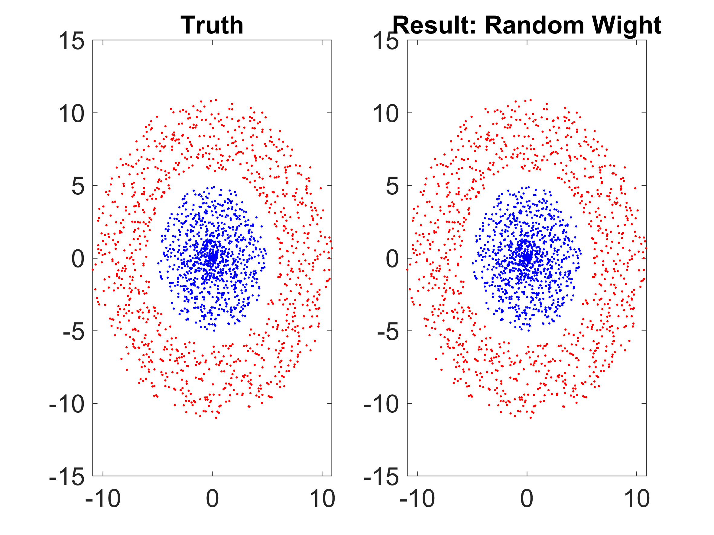
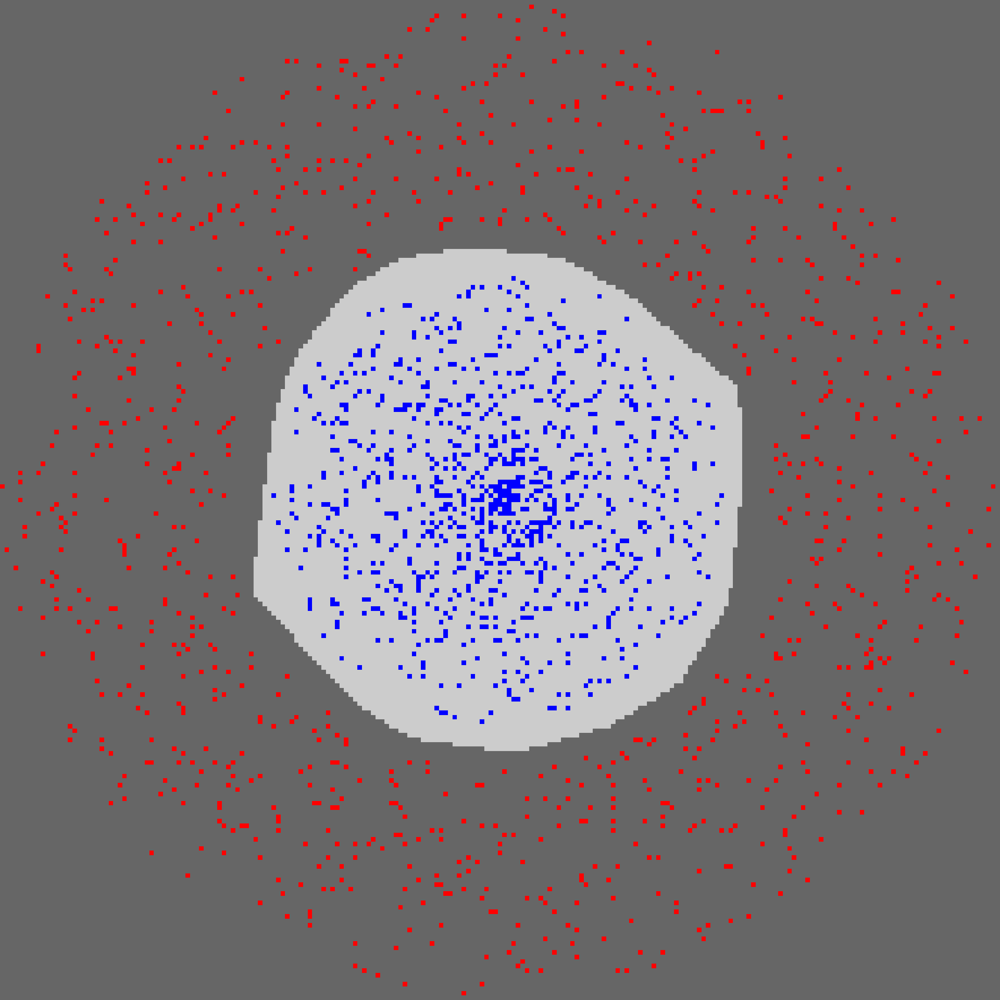

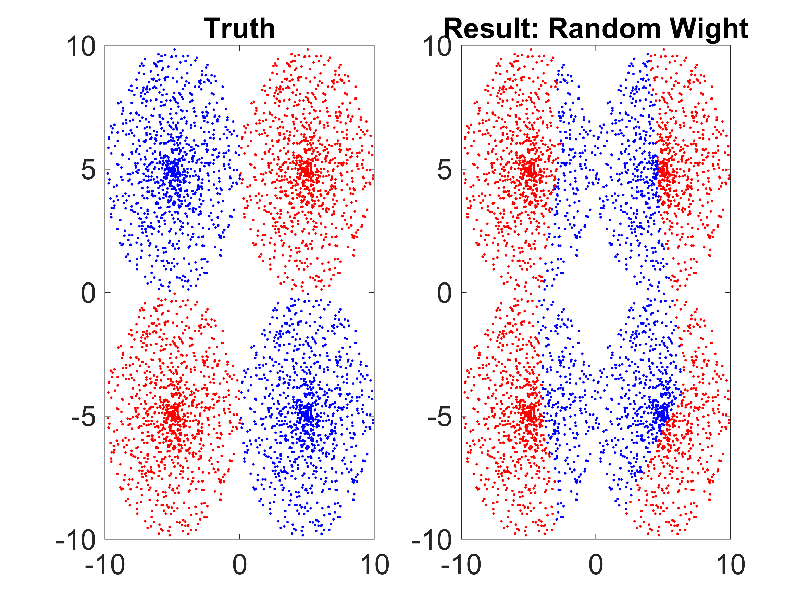
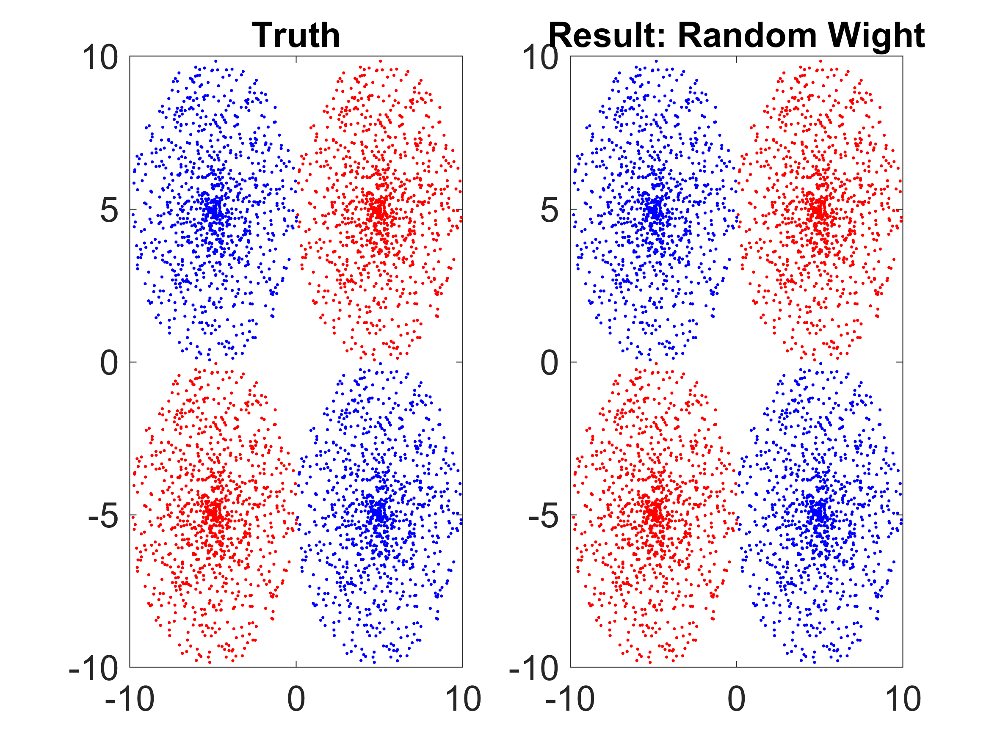
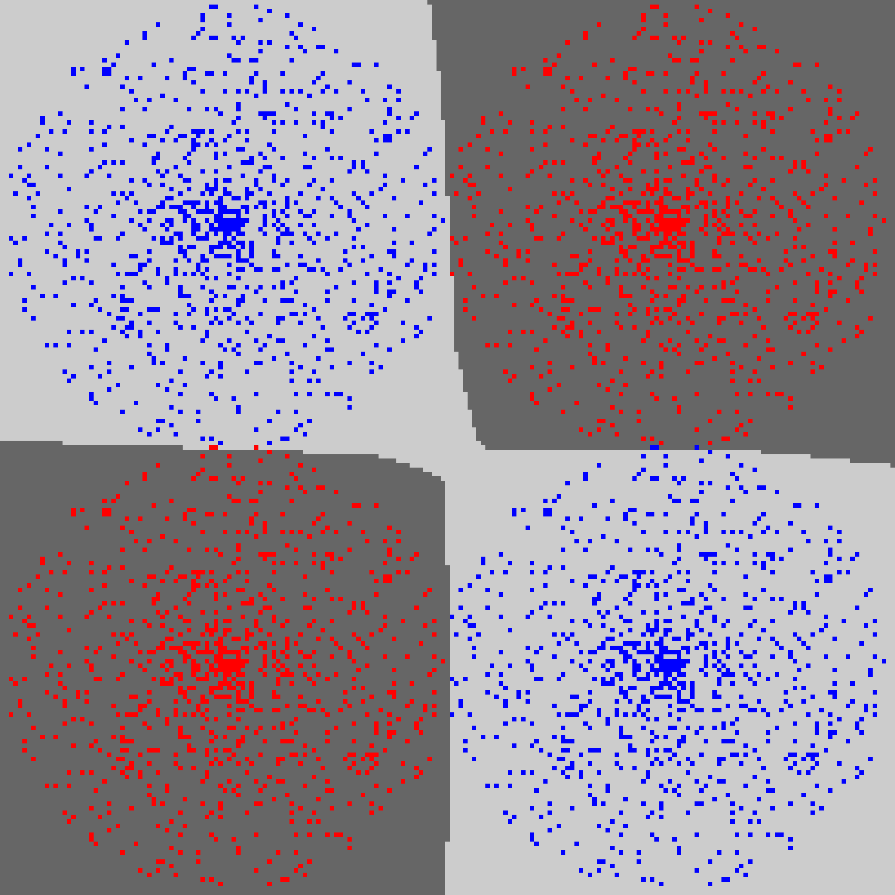

## CNN 
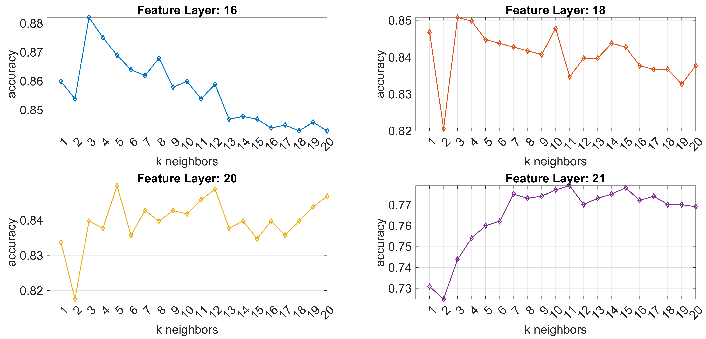
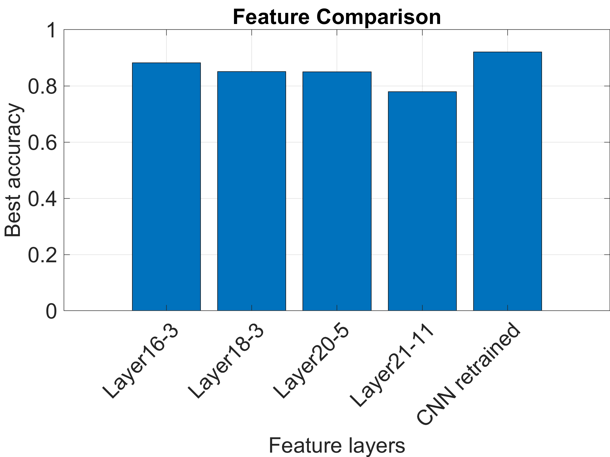

## FNN on MNIST

1. 初始化有影响；
2. 加大加深网络不一定有作用，反而使得training变得很慢；
3. Adam，速度快一些，但是效果没有提升；
4. SGB+Momentum效果较好，效果取决于learning rate；
5. data normalization无用；
6. weight decay：无用；
7. data augmentation：有显著提升，0.5%；
8. minibatches: 获取的gradient更稳定；
9. early stopping: 有用，防止overfitting;

## Result:
Accuracy: 98.85, winner of 2019 MNIST competition for course Advanced Image Analysis

## TODO

1. CNN;

## git repo:

1. zzutk;
2. sunshine;
3. https://github.com/jakejhansen/Advanced_Image_Analysis_02503
